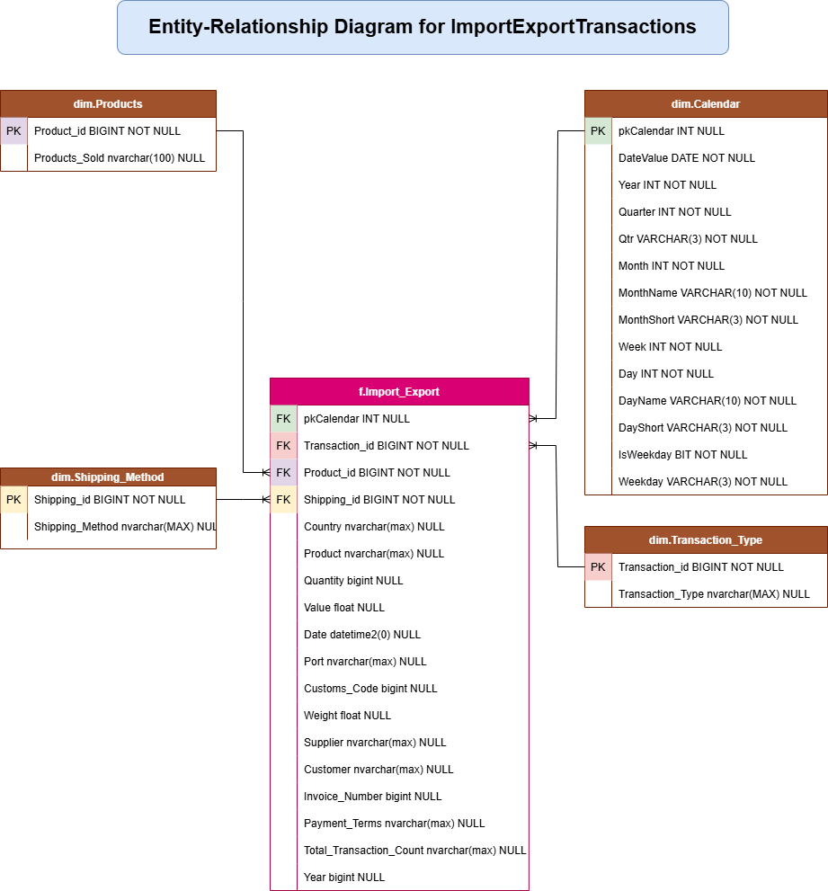

Entity-Relationship Diagram for ImportExportTransactions database
The project used the drawio software to establish the relationship between the the dimensions and fact tables.
Below is the ERD for ImportExportTransactions database for the project.

International Trade Analysis 💰📊
Below is a project that analyzes international trade in various countries around the globe. The data for the analysis was obtained from  kaggle.com. The analysis's results are crucial for economic plans, business choices, and policy measures within the international market. It offers a data-based framework for comprehending the flow of goods, services, and capital across international boundaries and their effects on national and global economies.

Using SQL Server Management Studio to Create Database 🗄️🗄️
The steps in creating the database and its associated schemas for the project were guided by the techniques outlined in the W3Schools. The W3School tutorial was used to identify all constraints in the database used for the project.

Database Creation 🗄️
CREATE DATABASE ImportExportTransactions
Creating Schemas for ImportExportTransactions Database
The following schemas were created for the database to function:

dim
fact
stag
/*********************************************************/
/******************    Schema DDL       ******************/
/*********************************************************/

IF NOT EXISTS (SELECT * FROM sys.schemas WHERE name = 'dim' ) 
BEGIN
    EXEC sp_executesql N'CREATE SCHEMA dim AUTHORIZATION dbo;'
END
;

GO

IF NOT EXISTS (SELECT * FROM sys.schemas WHERE name = 'stg' ) 
BEGIN
    EXEC sp_executesql N'CREATE SCHEMA stg AUTHORIZATION dbo;'
END
;

GO

IF NOT EXISTS (SELECT * FROM sys.schemas WHERE name = 'fact' ) 
BEGIN
    EXEC sp_executesql N'CREATE SCHEMA f AUTHORIZATION dbo;'
END
Dimensions Creation 🗄️
The project employed the Ralph Kimball principles to create the following dimensions and facts for the project:

dim.Products
dim.Shipping_method
dim.Transaction_Type
dim.Calendar 
fact.Import_Export
Entity-Relationship Diagram (ERD) for ImportExportTransactions
The project employed drawio software to draw the relationship between the various dimension tables and the fact table.

Creating dim.Product Table 🗄️
/*********************************************************/
/******************  Products DIM DDL   ******************/
/*********************************************************/

IF NOT EXISTS (SELECT * FROM INFORMATION_SCHEMA.TABLES WHERE TABLE_SCHEMA = 'dim' AND TABLE_NAME = 'Products')
BEGIN
    CREATE TABLE dim.Products(
    Product_id BIGINT NOT NULL,
    Products_Sold nvarchar(100) NULL
)
;

ALTER TABLE dim.Products
ADD CONSTRAINT PK_Products_LUP PRIMARY KEY(Product_id);

END

GO
Creating dim.Shipping_Method Table 🗄️
/*********************************************************/
/***************  Shipping_Method DIM DDL  ***************/
/*********************************************************/

IF NOT EXISTS (SELECT * FROM INFORMATION_SCHEMA.TABLES WHERE TABLE_SCHEMA = 'dim' AND TABLE_NAME = 'Shipping_Method')
BEGIN
CREATE TABLE dim.Shipping_Method (
    Shipping_id BIGINT NOT NULL,
    Shipping_Method nvarchar(MAX) NULL
)

    ALTER TABLE dim.Shipping_Method
    ADD CONSTRAINT PK_Shipping_Method PRIMARY KEY(Shipping_id);

END

GO
Creating dim.Transaction_Type Table 🗄️
/*********************************************************/
/***************  Transaction_Type DIM DDL  **************/
/*********************************************************/

IF NOT EXISTS (SELECT * FROM INFORMATION_SCHEMA.TABLES WHERE TABLE_SCHEMA = 'dim' AND TABLE_NAME = 'Transaction_Type')
BEGIN
CREATE TABLE dim.Transaction_Type (
    Transaction_id BIGINT NOT NULL,
    Transaction_Type nvarchar(MAX) NULL
)

ALTER TABLE dim.Transaction_Type
ADD CONSTRAINT PK_Transaction_Type PRIMARY KEY(Transaction_id)

END
GO
Creating dim.Calendar Table 🗓️
/*********************************************************/
/****************** Calendar DIM Script ******************/
/*********************************************************/

IF NOT EXISTS (SELECT * FROM INFORMATION_SCHEMA.TABLES WHERE TABLE_SCHEMA = 'dim' AND TABLE_NAME = 'Calendar')
BEGIN
-- Create the Calendar table
CREATE TABLE dim.Calendar
(
    pkCalendar INT(1) NULL,
    DateValue DATE NOT NULL,
    Year INT NOT NULL,
    Quarter INT NOT NULL,
    Qtr VARCHAR(3) NOT NULL,
    Month INT NOT NULL,
    MonthName VARCHAR(10) NOT NULL,
    MonthShort VARCHAR(3) NOT NULL,
    Week INT NOT NULL,
    Day INT NOT NULL,
    DayName VARCHAR(10) NOT NULL,
    DayShort VARCHAR(3) NOT NULL,
    IsWeekday BIT NOT NULL,
    Weekday VARCHAR(3) NOT NULL
)
;

    ALTER TABLE dim.Calendar
    ADD CONSTRAINT PK_Calendar_Julian PRIMARY KEY(pkCalendar);

    ALTER TABLE dim.Calendar
    ADD CONSTRAINT UC_Calendar UNIQUE (DateValue);
END
GO
Creating fact.Import_Export
/*********************************************************/
/***************  f.Import_Export   **************/
/*********************************************************/

IF EXISTS (SELECT * FROM INFORMATION_SCHEMA.TABLES WHERE TABLE_SCHEMA = 'f' AND TABLE_NAME = 'Import_Export')
BEGIN 
    DROP TABLE f.Import_Export;
END

CREATE TABLE f.Import_Export(
    pkCalendar INT NULL,
    Transaction_id BIGINT NOT NULL,
    Product_id BIGINT NOT NULL,
    Shipping_id BIGINT NOT NULL,
    Country nvarchar(max) NULL,
    Product nvarchar(max) NULL,
    Quantity bigint NULL,
    Value float NULL,
    Date datetime2(0) NULL,
    Port nvarchar(max) NULL,
    Customs_Code bigint NULL,
    Weight float NULL,
    Supplier nvarchar(max) NULL,
    Customer nvarchar(max) NULL,
    Invoice_Number bigint NULL,
    Payment_Terms nvarchar(max) NULL,
    Total_Transaction_Count nvarchar(max) NULL,
    Year bigint NULL
)
Adding Constraints and Foreign Keys(FK) in the fact table
Possible constraints and foreign keys were added to the fact table to establish the relationship between the dimension tables and the fact table.

FK_Import_Export_Products
FK_Import_Export_Shipping_Method
FK_Import_Export_Transaction_Type
Creating Foreign Key on the fact table for the Products table
ALTER TABLE f.Import_Export
ADD  CONSTRAINT FK_Import_Export_Products FOREIGN KEY(Product_id)
REFERENCES dim.Products(Product_id)
Creating Foreign Key on the fact table for the Shipping_Method table
ALTER TABLE f.Import_Export
ADD  CONSTRAINT FK_Import_Export_Shipping_Method FOREIGN KEY(Shipping_id)
REFERENCES dim.Shipping_Method(Shipping_id)
Creating Foreign Key on the fact table for the Transaction_Type table
ALTER TABLE f.Import_Export
ADD  CONSTRAINT FK_Import_Export_Transaction_Type FOREIGN KEY(Transaction_id)
REFERENCES dim.Transaction_Type(Transaction_id)
Creating Foreign Key on the fact table for the Calendar table
ALTER TABLE f.Import_Export
ADD CONSTRAINT FK_Import_Export_Calendar FOREIGN KEY (pkCalendar)
    REFERENCES dim.Calendar(pkCalendar)
